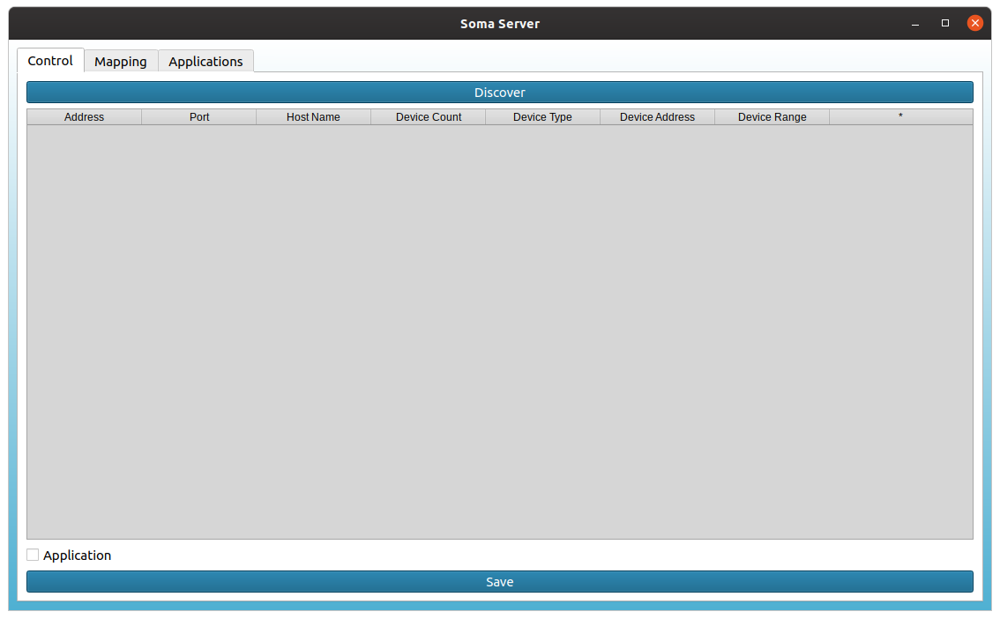
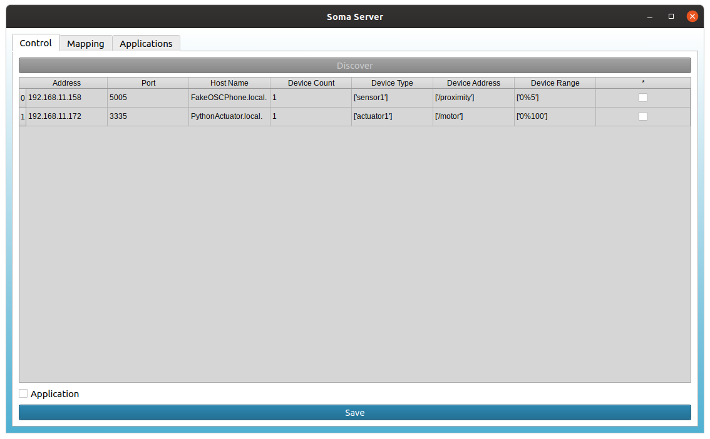
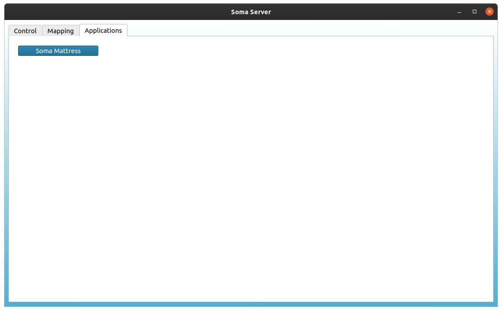
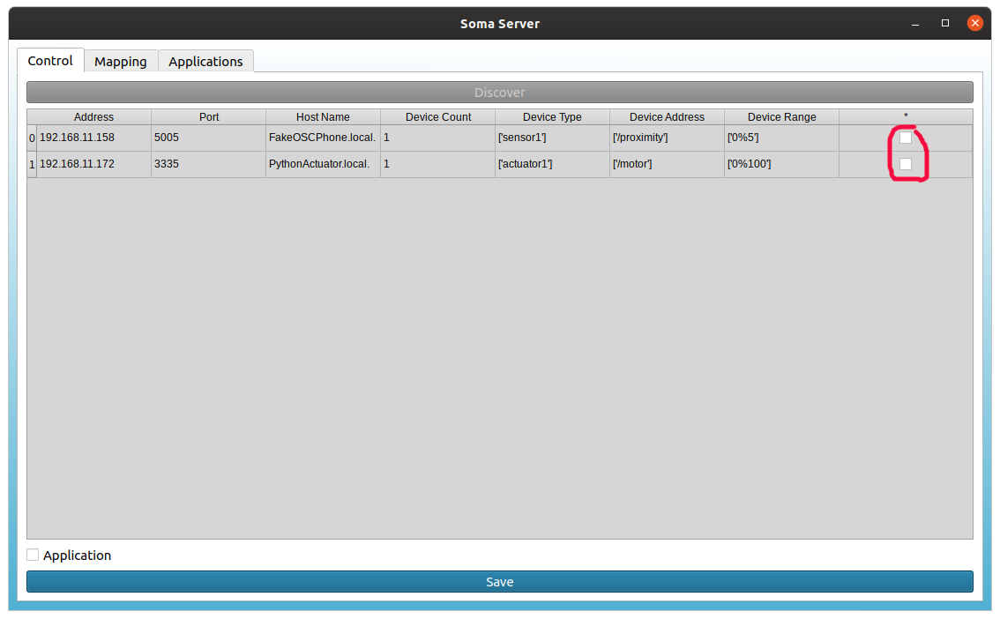
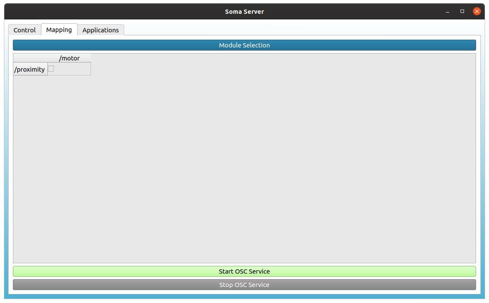
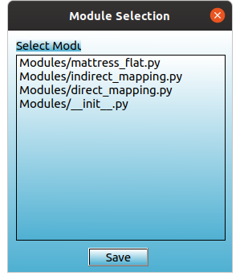

# Smart Implicit Hub

The "Smart Implicit Hub" is the central heart that orchestrates all implicit interaction-based devices. It provides several services in a single system.

* Sensor and actuator discovery
  * Discover sensors and actuators in your local network using MDNS (also known as Bonjour or Avahi).
* Sensor and actuator allocation
  * In case multiple "Smart Implicit Hubs" are running in a local network, one "Hub" can allocate a specific device for itself. The device will then send its data to this "Hub".
* Orchestration of sensor inputs to corresponding actions of actuators
  * Currently only simple mapping of sensor inputs to actuator outputs is implemented.
* Integration of external sensors and actuators (e.g., smart phones)
  * External sensors and actuators that do not support MDNS can be easily integrated and used.

## Getting Started

### Prerequisite

If you run the "Smart Implicit Hub" for the first time, you need to install the python dependencies first.

This application requires python 3 and was tested with python 3.7. You can check your python version with

```bash
python --version
```

To install the necessary requirements run

```bash
pip install -r requirements.txt
```

Furthermore, you need to be in a local network that has an IP starting with "192.....".

### Let's Go

To start the "Smart Implicit Hub" run

```bash
python SmartImplicitHub.py
```

A window will appear that looks as follows:



If you have running implicit interaction-based devices, they should appear if you click on the *Discover* button.



The table shows their IP address, the OSC port, they will listening on, how many sensors and actuators a single device offers, if it is a sensor or an actuator, the OSC path, and also the range of their values (from%to).

#### Running an existing application

If you want to run an already existing application like the "Soma Mattress". Just select Application above the "Save" button and press "Save".

This will lead you to the application tab, where you just have to press the desired application (currently there is only the "Soma Mattress").



#### Connecting Sensors Inputs and Actuators Manually

If you want to connect sensor inputs manually with actuators, select the desired device by clicking the checkbox next to it. 



If you run multiple "Hubs" in the local network, the selected devices should disappear on the other "Hubs". After selecting the desired devices klick the "Save" button.

This will lead you to the "Mapping" tab, where you can connect your sensors (y-axis) with your actuators (x-axis) by clicking on the corresponding checkboxes. 



If you select a sensor-actuator-pair a new dialog will open, asking you which mapping function you want to use.



Select one module and press save. The dialog will disappear. Now press the "Start OSC Service" button and your sensors should send its sensor readings to the "Hub" while the "Hub" forwards the modified values (according to the selected module) to the actuator.


 ## Code Layout

### Example Devices

You can find virtual example devices in the folder ```TestDevices```. Note that you can only run either one sensor or one actuator on your PC. Thus, you might need a second PC.

``` FakeSensor.py``` is used to run an external device, e.g, an OSC app on your smart phone. You need to modify your sensor/actuator 

```
desc = {'sensor1': '/proximity:0%5'}
```

Furthermore, you need to change the IP address and the *listening* port. The outgoing port is always 3333.

### Creating a new Application

To create a new application, you can use the ``` SomaMattress.py``` as an example. For automatically selecting devices, and functions, we use a .csv file. An example can be found in ``` AppMatrix/SomaMattressMatrix.csv```.

The file looks like this.

| ServiceName                             | Sensor Address | Coords  | Actuator                            | Actuator Address | Module        | Argument |
| --------------------------------------- | -------------- | ------- | ----------------------------------- | ---------------- | ------------- | -------- |
| Python25PressureSensor._osc._udp.local. | /pressure1     | (0,0,0) | Python25MotorsGrid._osc._udp.local. | /motor1          | mattress_flat | -0,1     |
| Python25PressureSensor._osc._udp.local. | /pressure1     | (0,0,1) | Python25MotorsGrid._osc._udp.local. | /motor2          | mattress_flat | (1,0.5)  |
| Python25PressureSensor._osc._udp.local. | /pressure1     | (0,2,0) | Python25MotorsGrid._osc._udp.local. | /motor3          | mattress_flat | (2,0.5)  |
| Python25PressureSensor._osc._udp.local. | /pressure1     | (0,3,0) | Python25MotorsGrid._osc._udp.local. | /motor4          | mattress_flat | (3,0.5)  |
| Python25PressureSensor._osc._udp.local. | /pressure1     | (0,4,0) | Python25MotorsGrid._osc._udp.local. | /motor5          | mattress_flat | (4,0.5)  |

Note that the Coords column is currently ignored. The Argument column provides (optional) parameters for the functions defined in the Module column.

### Modules and Blocks

A module describes a behavior (an output) based on an input. The behavior can be described with the help of so called blocks. Blocks are small, stateless functions. You can freely add blocks and modules to describe your desired behavior.

## Trouble Shooting

* Are you connected with your local network?
* Maybe reconnect to your router!

## Known Issues

* The Soma Mattress application does not allocate the sensors and actuators. Other "Hubs" could allocate them, thus the sensors will send their data to the new "Hub".